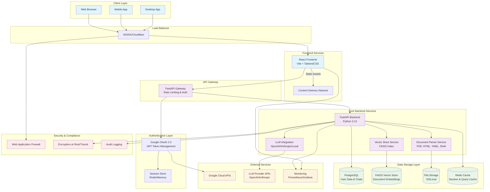

```mermaid
graph TB
    subgraph "Client Layer"
        A[Web Browser]
        B[Mobile App]
        C[Desktop App]
    end

    subgraph "Load Balancer"
        LB[NGINX/Cloudflare]
    end

    subgraph "Frontend Services"
        FE[React Frontend<br/>Vite + TailwindCSS]
        FE --> |Static Assets| CDN[Content Delivery Network]
    end

    subgraph "API Gateway"
        GW[FastAPI Gateway<br/>Rate Limiting & Auth]
    end

    subgraph "Authentication Layer"
        AUTH[Google OAuth 2.0<br/>JWT Token Management]
        SESSION[Session Store<br/>Redis/Memory]
    end

    subgraph "Core Backend Services"
        API[FastAPI Backend<br/>Python 3.13]
        PARSER[Document Parser Service<br/>PDF, HTML, YAML, Shell]
        VECTOR[Vector Store Service<br/>FAISS Index]
        LLM[LLM Integration<br/>OpenAI/Anthropic/Local]
    end

    subgraph "Data Storage Layer"
        DB[(PostgreSQL<br/>User Data & Chats)]
        VECTOR_DB[(FAISS Vector Store<br/>Document Embeddings)]
        FILE_STORE[(File Storage<br/>S3/Local)]
        CACHE[(Redis Cache<br/>Session & Query Cache)]
    end

    subgraph "External Services"
        GOOGLE[Google Cloud APIs]
        LLM_API[LLM Provider APIs<br/>OpenAI/Anthropic]
        MONITOR[Monitoring<br/>Prometheus/Grafana]
    end

    subgraph "Security & Compliance"
        WAF[Web Application Firewall]
        ENCRYPT[Encryption at Rest/Transit]
        AUDIT[Audit Logging]
    end

    %% Client to Load Balancer
    A --> LB
    B --> LB
    C --> LB

    %% Load Balancer to Frontend
    LB --> FE

    %% Frontend to API Gateway
    FE --> GW

    %% API Gateway to Auth
    GW --> AUTH
    AUTH --> SESSION
    AUTH --> GOOGLE

    %% API Gateway to Backend
    GW --> API

    %% Backend Services Connections
    API --> PARSER
    API --> VECTOR
    API --> LLM

    %% Data Layer Connections
    API --> DB
    VECTOR --> VECTOR_DB
    PARSER --> FILE_STORE
    API --> CACHE

    %% External Connections
    LLM --> LLM_API

    %% Security Layer
    LB --> WAF
    API --> ENCRYPT
    API --> AUDIT

    %% Monitoring
    API --> MONITOR
    FE --> MONITOR

    %% Styling
    classDef frontend fill:#e1f5fe
    classDef backend fill:#f3e5f5
    classDef database fill:#e8f5e8
    classDef external fill:#fff3e0
    classDef security fill:#ffebee

    class A,B,C,FE frontend
    class API,PARSER,VECTOR,LLM,GW backend
    class DB,VECTOR_DB,FILE_STORE,CACHE database
    class GOOGLE,LLM_API,MONITOR external
    class WAF,ENCRYPT,AUDIT security
```
