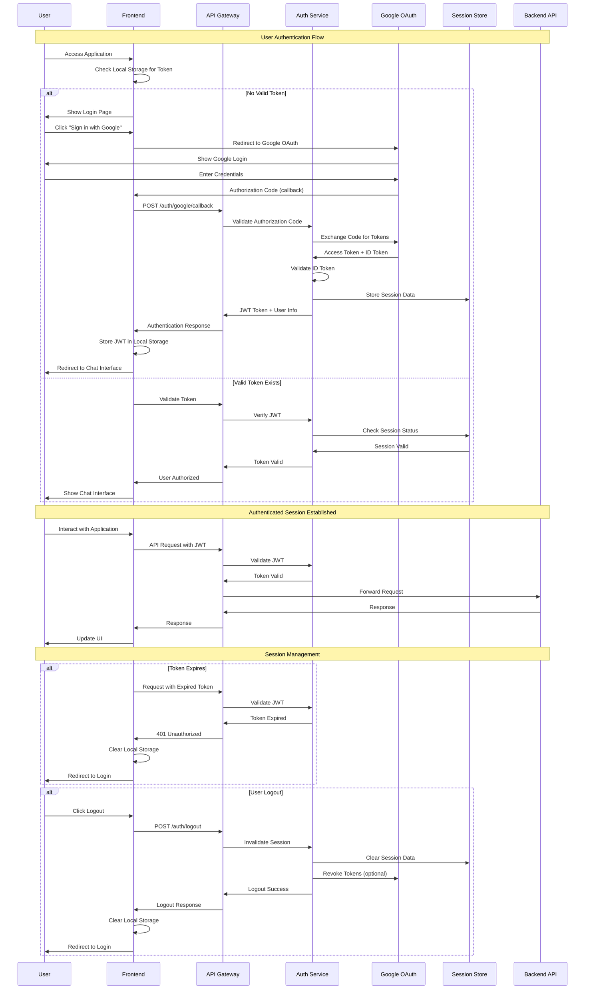

```mermaid
sequenceDiagram
    participant U as User
    participant FE as Frontend
    participant GW as API Gateway
    participant AUTH as Auth Service
    participant GOOGLE as Google OAuth
    participant SESSION as Session Store
    participant API as Backend API

    Note over U,API: User Authentication Flow

    U->>FE: Access Application
    FE->>FE: Check Local Storage for Token

    alt No Valid Token
        FE->>U: Show Login Page
        U->>FE: Click "Sign in with Google"
        FE->>GOOGLE: Redirect to Google OAuth
        GOOGLE->>U: Show Google Login
        U->>GOOGLE: Enter Credentials
        GOOGLE->>FE: Authorization Code (callback)
        FE->>GW: POST /auth/google/callback
        GW->>AUTH: Validate Authorization Code
        AUTH->>GOOGLE: Exchange Code for Tokens
        GOOGLE->>AUTH: Access Token + ID Token
        AUTH->>AUTH: Validate ID Token
        AUTH->>SESSION: Store Session Data
        AUTH->>GW: JWT Token + User Info
        GW->>FE: Authentication Response
        FE->>FE: Store JWT in Local Storage
        FE->>U: Redirect to Chat Interface
    else Valid Token Exists
        FE->>GW: Validate Token
        GW->>AUTH: Verify JWT
        AUTH->>SESSION: Check Session Status
        SESSION->>AUTH: Session Valid
        AUTH->>GW: Token Valid
        GW->>FE: User Authorized
        FE->>U: Show Chat Interface
    end

    Note over U,API: Authenticated Session Established

    U->>FE: Interact with Application
    FE->>GW: API Request with JWT
    GW->>AUTH: Validate JWT
    AUTH->>GW: Token Valid
    GW->>API: Forward Request
    API->>GW: Response
    GW->>FE: Response
    FE->>U: Update UI

    Note over U,API: Session Management

    alt Token Expires
        FE->>GW: Request with Expired Token
        GW->>AUTH: Validate JWT
        AUTH->>GW: Token Expired
        GW->>FE: 401 Unauthorized
        FE->>FE: Clear Local Storage
        FE->>U: Redirect to Login
    end

    alt User Logout
        U->>FE: Click Logout
        FE->>GW: POST /auth/logout
        GW->>AUTH: Invalidate Session
        AUTH->>SESSION: Clear Session Data
        AUTH->>GOOGLE: Revoke Tokens (optional)
        AUTH->>GW: Logout Success
        GW->>FE: Logout Response
        FE->>FE: Clear Local Storage
        FE->>U: Redirect to Login
    end
```
