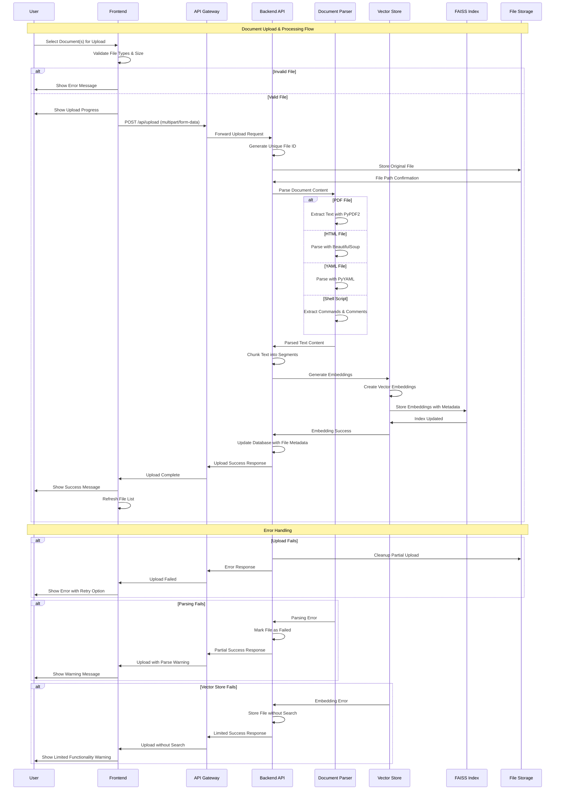

```mermaid
sequenceDiagram
    participant U as User
    participant FE as Frontend
    participant GW as API Gateway
    participant API as Backend API
    participant PARSER as Document Parser
    participant VECTOR as Vector Store
    participant FAISS as FAISS Index
    participant STORAGE as File Storage

    Note over U,STORAGE: Document Upload & Processing Flow

    U->>FE: Select Document(s) for Upload
    FE->>FE: Validate File Types & Size

    alt Invalid File
        FE->>U: Show Error Message
    else Valid File
        FE->>U: Show Upload Progress
        FE->>GW: POST /api/upload (multipart/form-data)
        GW->>API: Forward Upload Request

        API->>API: Generate Unique File ID
        API->>STORAGE: Store Original File
        STORAGE->>API: File Path Confirmation

        API->>PARSER: Parse Document Content

        alt PDF File
            PARSER->>PARSER: Extract Text with PyPDF2
        else HTML File
            PARSER->>PARSER: Parse with BeautifulSoup
        else YAML File
            PARSER->>PARSER: Parse with PyYAML
        else Shell Script
            PARSER->>PARSER: Extract Commands & Comments
        end

        PARSER->>API: Parsed Text Content

        API->>API: Chunk Text into Segments
        API->>VECTOR: Generate Embeddings
        VECTOR->>VECTOR: Create Vector Embeddings
        VECTOR->>FAISS: Store Embeddings with Metadata
        FAISS->>VECTOR: Index Updated
        VECTOR->>API: Embedding Success

        API->>API: Update Database with File Metadata
        API->>GW: Upload Success Response
        GW->>FE: Upload Complete
        FE->>U: Show Success Message
        FE->>FE: Refresh File List
    end

    Note over U,STORAGE: Error Handling

    alt Upload Fails
        API->>STORAGE: Cleanup Partial Upload
        API->>GW: Error Response
        GW->>FE: Upload Failed
        FE->>U: Show Error with Retry Option
    end

    alt Parsing Fails
        PARSER->>API: Parsing Error
        API->>API: Mark File as Failed
        API->>GW: Partial Success Response
        GW->>FE: Upload with Parse Warning
        FE->>U: Show Warning Message
    end

    alt Vector Store Fails
        VECTOR->>API: Embedding Error
        API->>API: Store File without Search
        API->>GW: Limited Success Response
        GW->>FE: Upload without Search
        FE->>U: Show Limited Functionality Warning
    end
```
