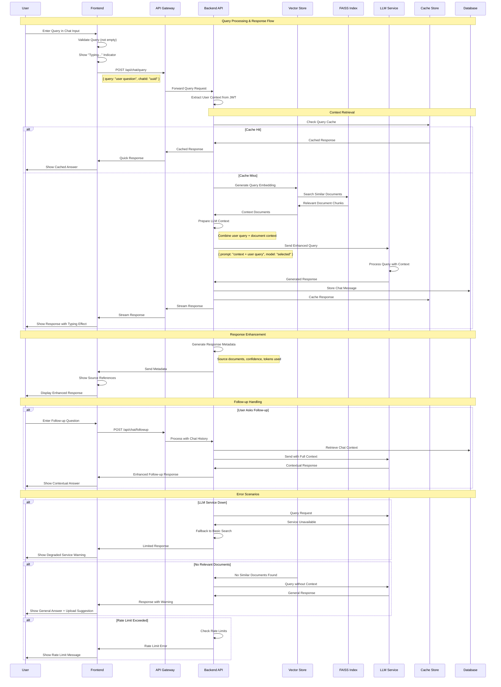

```mermaid
sequenceDiagram
    participant U as User
    participant FE as Frontend
    participant GW as API Gateway
    participant API as Backend API
    participant VECTOR as Vector Store
    participant FAISS as FAISS Index
    participant LLM as LLM Service
    participant CACHE as Cache Store
    participant DB as Database

    Note over U,DB: Query Processing & Response Flow

    U->>FE: Enter Query in Chat Input
    FE->>FE: Validate Query (not empty)
    FE->>FE: Show "Typing..." Indicator

    FE->>GW: POST /api/chat/query
    Note right of FE: { query: "user question", chatId: "uuid" }

    GW->>API: Forward Query Request
    API->>API: Extract User Context from JWT

    Note over API,DB: Context Retrieval

    API->>CACHE: Check Query Cache

    alt Cache Hit
        CACHE->>API: Cached Response
        API->>GW: Cached Response
        GW->>FE: Quick Response
        FE->>U: Show Cached Answer
    else Cache Miss
        API->>VECTOR: Generate Query Embedding
        VECTOR->>FAISS: Search Similar Documents
        FAISS->>VECTOR: Relevant Document Chunks
        VECTOR->>API: Context Documents

        API->>API: Prepare LLM Context
        Note right of API: Combine user query + document context

        API->>LLM: Send Enhanced Query
        Note right of API: { prompt: "context + user query", model: "selected" }

        LLM->>LLM: Process Query with Context
        LLM->>API: Generated Response

        API->>DB: Store Chat Message
        API->>CACHE: Cache Response

        API->>GW: Stream Response
        GW->>FE: Stream Response
        FE->>U: Show Response with Typing Effect
    end

    Note over U,DB: Response Enhancement

    API->>API: Generate Response Metadata
    Note right of API: Source documents, confidence, tokens used

    API->>FE: Send Metadata
    FE->>FE: Show Source References
    FE->>U: Display Enhanced Response

    Note over U,DB: Follow-up Handling

    alt User Asks Follow-up
        U->>FE: Enter Follow-up Question
        FE->>GW: POST /api/chat/followup
        GW->>API: Process with Chat History
        API->>DB: Retrieve Chat Context
        API->>LLM: Send with Full Context
        LLM->>API: Contextual Response
        API->>FE: Enhanced Follow-up Response
        FE->>U: Show Contextual Answer
    end

    Note over U,DB: Error Scenarios

    alt LLM Service Down
        API->>LLM: Query Request
        LLM->>API: Service Unavailable
        API->>API: Fallback to Basic Search
        API->>FE: Limited Response
        FE->>U: Show Degraded Service Warning
    end

    alt No Relevant Documents
        VECTOR->>API: No Similar Documents Found
        API->>LLM: Query without Context
        LLM->>API: General Response
        API->>FE: Response with Warning
        FE->>U: Show General Answer + Upload Suggestion
    end

    alt Rate Limit Exceeded
        API->>API: Check Rate Limits
        API->>FE: Rate Limit Error
        FE->>U: Show Rate Limit Message
    end
```
