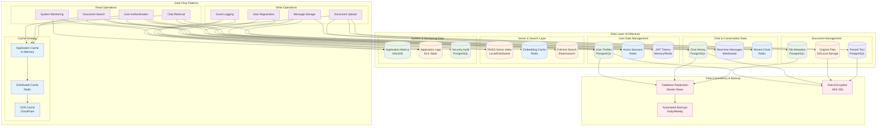

```mermaid
graph TB
    subgraph "Data Layer Architecture"
        subgraph "User Data Management"
            USER_DB[(User Profiles<br/>PostgreSQL)]
            SESSION_STORE[(Active Sessions<br/>Redis)]
            AUTH_TOKENS[(JWT Tokens<br/>Memory/Redis)]
        end

        subgraph "Chat & Conversation Data"
            CHAT_DB[(Chat History<br/>PostgreSQL)]
            MESSAGE_QUEUE[(Real-time Messages<br/>WebSocket)]
            CHAT_CACHE[(Recent Chats<br/>Redis)]
        end

        subgraph "Document Management"
            FILE_METADATA[(File Metadata<br/>PostgreSQL)]
            BLOB_STORAGE[(Original Files<br/>S3/Local Storage)]
            PARSED_CONTENT[(Parsed Text<br/>PostgreSQL)]
        end

        subgraph "Vector & Search Layer"
            VECTOR_INDEX[(FAISS Vector Index<br/>Local/Distributed)]
            EMBEDDINGS_CACHE[(Embedding Cache<br/>Redis)]
            SEARCH_INDEX[(Full-text Search<br/>Elasticsearch)]
        end

        subgraph "System & Monitoring Data"
            METRICS_DB[(Application Metrics<br/>InfluxDB)]
            LOG_STORAGE[(Application Logs<br/>ELK Stack)]
            AUDIT_TRAIL[(Security Audit<br/>PostgreSQL)]
        end
    end

    subgraph "Data Flow Patterns"
        subgraph "Read Operations"
            READ_USER[User Authentication]
            READ_CHAT[Chat Retrieval]
            READ_SEARCH[Document Search]
            READ_MONITOR[System Monitoring]
        end

        subgraph "Write Operations"
            WRITE_USER[User Registration]
            WRITE_CHAT[Message Storage]
            WRITE_DOC[Document Upload]
            WRITE_LOG[Event Logging]
        end

        subgraph "Cache Strategy"
            L1_CACHE[Application Cache<br/>In-Memory]
            L2_CACHE[Distributed Cache<br/>Redis]
            L3_CACHE[CDN Cache<br/>CloudFlare]
        end
    end

    subgraph "Data Consistency & Backup"
        REPLICATION[Database Replication<br/>Master-Slave]
        BACKUP[Automated Backups<br/>Daily/Weekly]
        ENCRYPTION[Data Encryption<br/>AES-256]
    end

    %% User Data Connections
    READ_USER --> USER_DB
    READ_USER --> SESSION_STORE
    READ_USER --> AUTH_TOKENS

    WRITE_USER --> USER_DB
    WRITE_USER --> SESSION_STORE

    %% Chat Data Connections
    READ_CHAT --> CHAT_DB
    READ_CHAT --> CHAT_CACHE

    WRITE_CHAT --> CHAT_DB
    WRITE_CHAT --> MESSAGE_QUEUE
    WRITE_CHAT --> CHAT_CACHE

    %% Document Data Connections
    READ_SEARCH --> VECTOR_INDEX
    READ_SEARCH --> EMBEDDINGS_CACHE
    READ_SEARCH --> SEARCH_INDEX

    WRITE_DOC --> FILE_METADATA
    WRITE_DOC --> BLOB_STORAGE
    WRITE_DOC --> PARSED_CONTENT
    WRITE_DOC --> VECTOR_INDEX

    %% Monitoring Connections
    READ_MONITOR --> METRICS_DB
    READ_MONITOR --> LOG_STORAGE

    WRITE_LOG --> METRICS_DB
    WRITE_LOG --> LOG_STORAGE
    WRITE_LOG --> AUDIT_TRAIL

    %% Cache Hierarchy
    READ_USER --> L1_CACHE
    READ_CHAT --> L1_CACHE
    READ_SEARCH --> L1_CACHE

    L1_CACHE --> L2_CACHE
    L2_CACHE --> L3_CACHE

    %% Backup & Consistency
    USER_DB --> REPLICATION
    CHAT_DB --> REPLICATION
    FILE_METADATA --> REPLICATION

    REPLICATION --> BACKUP

    USER_DB --> ENCRYPTION
    CHAT_DB --> ENCRYPTION
    BLOB_STORAGE --> ENCRYPTION
    PARSED_CONTENT --> ENCRYPTION

    %% Styling
    classDef database fill:#e8f5e8
    classDef cache fill:#e3f2fd
    classDef storage fill:#fff3e0
    classDef security fill:#ffebee
    classDef operations fill:#f3e5f5

    class USER_DB,CHAT_DB,FILE_METADATA,METRICS_DB,AUDIT_TRAIL database
    class SESSION_STORE,CHAT_CACHE,EMBEDDINGS_CACHE,L1_CACHE,L2_CACHE,L3_CACHE cache
    class BLOB_STORAGE,VECTOR_INDEX,SEARCH_INDEX,LOG_STORAGE storage
    class ENCRYPTION,REPLICATION,BACKUP security
    class READ_USER,READ_CHAT,READ_SEARCH,READ_MONITOR,WRITE_USER,WRITE_CHAT,WRITE_DOC,WRITE_LOG operations
```
