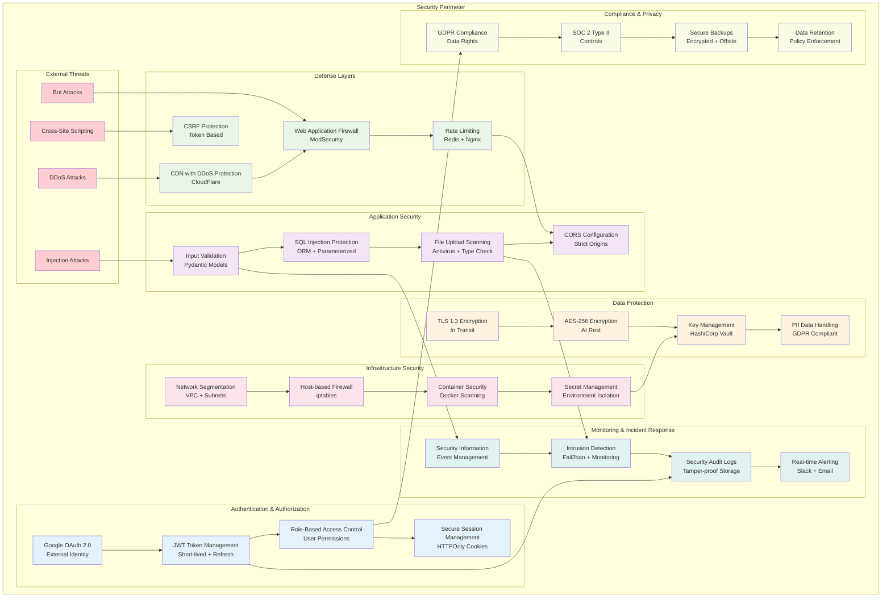

```mermaid
graph TB
    subgraph "Security Perimeter"
        subgraph "External Threats"
            DDOS[DDoS Attacks]
            BOT[Bot Attacks]
            INJECT[Injection Attacks]
            XSS[Cross-Site Scripting]
        end

        subgraph "Defense Layers"
            CDN[CDN with DDoS Protection<br/>CloudFlare]
            WAF[Web Application Firewall<br/>ModSecurity]
            RATE[Rate Limiting<br/>Redis + Nginx]
            CSRF[CSRF Protection<br/>Token Based]
        end

        subgraph "Authentication & Authorization"
            OAUTH[Google OAuth 2.0<br/>External Identity]
            JWT[JWT Token Management<br/>Short-lived + Refresh]
            RBAC[Role-Based Access Control<br/>User Permissions]
            SESSION[Secure Session Management<br/>HTTPOnly Cookies]
        end

        subgraph "Data Protection"
            ENCRYPT_TRANSIT[TLS 1.3 Encryption<br/>In Transit]
            ENCRYPT_REST[AES-256 Encryption<br/>At Rest]
            KEY_MGMT[Key Management<br/>HashiCorp Vault]
            PII[PII Data Handling<br/>GDPR Compliant]
        end

        subgraph "Application Security"
            INPUT_VAL[Input Validation<br/>Pydantic Models]
            SQL_PROTECT[SQL Injection Protection<br/>ORM + Parameterized]
            FILE_SCAN[File Upload Scanning<br/>Antivirus + Type Check]
            CORS[CORS Configuration<br/>Strict Origins]
        end

        subgraph "Infrastructure Security"
            NETWORK[Network Segmentation<br/>VPC + Subnets]
            FIREWALL[Host-based Firewall<br/>iptables]
            CONTAINER[Container Security<br/>Docker Scanning]
            SECRETS[Secret Management<br/>Environment Isolation]
        end

        subgraph "Monitoring & Incident Response"
            SIEM[Security Information<br/>Event Management]
            INTRUSION[Intrusion Detection<br/>Fail2ban + Monitoring]
            AUDIT[Security Audit Logs<br/>Tamper-proof Storage]
            ALERT[Real-time Alerting<br/>Slack + Email]
        end

        subgraph "Compliance & Privacy"
            GDPR[GDPR Compliance<br/>Data Rights]
            SOC[SOC 2 Type II<br/>Controls]
            BACKUP[Secure Backups<br/>Encrypted + Offsite]
            RETENTION[Data Retention<br/>Policy Enforcement]
        end
    end

    %% Threat Mitigation Flow
    DDOS --> CDN
    BOT --> WAF
    INJECT --> INPUT_VAL
    XSS --> CSRF

    %% Defense Layer Flow
    CDN --> WAF
    WAF --> RATE
    RATE --> CORS

    %% Authentication Flow
    OAUTH --> JWT
    JWT --> RBAC
    RBAC --> SESSION

    %% Data Protection Flow
    ENCRYPT_TRANSIT --> ENCRYPT_REST
    ENCRYPT_REST --> KEY_MGMT
    KEY_MGMT --> PII

    %% Application Security Flow
    INPUT_VAL --> SQL_PROTECT
    SQL_PROTECT --> FILE_SCAN
    FILE_SCAN --> CORS

    %% Infrastructure Security Flow
    NETWORK --> FIREWALL
    FIREWALL --> CONTAINER
    CONTAINER --> SECRETS

    %% Monitoring Flow
    SIEM --> INTRUSION
    INTRUSION --> AUDIT
    AUDIT --> ALERT

    %% Compliance Flow
    GDPR --> SOC
    SOC --> BACKUP
    BACKUP --> RETENTION

    %% Cross-layer Security
    JWT --> AUDIT
    INPUT_VAL --> SIEM
    FILE_SCAN --> INTRUSION
    SECRETS --> KEY_MGMT
    RBAC --> GDPR

    %% Styling
    classDef threats fill:#ffcdd2
    classDef defense fill:#e8f5e8
    classDef auth fill:#e3f2fd
    classDef data fill:#fff3e0
    classDef app fill:#f3e5f5
    classDef infra fill:#fce4ec
    classDef monitor fill:#e0f2f1
    classDef compliance fill:#f9fbe7

    class DDOS,BOT,INJECT,XSS threats
    class CDN,WAF,RATE,CSRF defense
    class OAUTH,JWT,RBAC,SESSION auth
    class ENCRYPT_TRANSIT,ENCRYPT_REST,KEY_MGMT,PII data
    class INPUT_VAL,SQL_PROTECT,FILE_SCAN,CORS app
    class NETWORK,FIREWALL,CONTAINER,SECRETS infra
    class SIEM,INTRUSION,AUDIT,ALERT monitor
    class GDPR,SOC,BACKUP,RETENTION compliance
```
