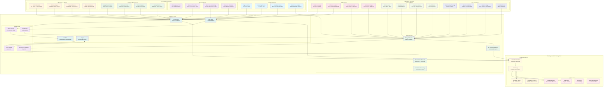

```mermaid
graph TB
    subgraph "Performance Monitoring"
        subgraph "Frontend Metrics"
            FE_LOAD[Page Load Time<br/>Core Web Vitals]
            FE_INTER[Interactivity Metrics<br/>FID, CLS, LCP]
            FE_ERROR[JavaScript Errors<br/>Error Boundary Tracking]
            FE_BUNDLE[Bundle Size Analysis<br/>Webpack Bundle Analyzer]
        end

        subgraph "Backend Metrics"
            BE_RESPONSE[API Response Time<br/>P95, P99 Latencies]
            BE_THROUGHPUT[Request Throughput<br/>RPS + Concurrent Users]
            BE_ERROR[Error Rate Monitoring<br/>4xx, 5xx Response Codes]
            BE_RESOURCE[Resource Utilization<br/>CPU, Memory, Disk I/O]
        end

        subgraph "Database Performance"
            DB_QUERY[Query Performance<br/>Slow Query Analysis]
            DB_CONN[Connection Pool<br/>Active/Idle Connections]
            DB_LOCK[Lock Analysis<br/>Deadlock Detection]
            DB_STORAGE[Storage Metrics<br/>Table Size, Index Usage]
        end

        subgraph "Infrastructure Metrics"
            INFRA_CPU[CPU Utilization<br/>Per Core + Load Average]
            INFRA_MEM[Memory Usage<br/>Available + Swap Usage]
            INFRA_NET[Network Metrics<br/>Bandwidth + Packet Loss]
            INFRA_DISK[Disk Performance<br/>IOPS + Queue Depth]
        end
    end

    subgraph "Application Monitoring"
        subgraph "User Experience"
            UX_JOURNEY[User Journey Tracking<br/>Funnel Analysis]
            UX_SESSION[Session Analytics<br/>Duration + Bounce Rate]
            UX_FEATURE[Feature Usage<br/>Click Tracking + Heatmaps]
            UX_SATISFACTION[User Satisfaction<br/>NPS + Feedback]
        end

        subgraph "Business Metrics"
            BIZ_USERS[Active Users<br/>DAU, MAU, WAU]
            BIZ_RETENTION[User Retention<br/>Cohort Analysis]
            BIZ_CONVERSION[Conversion Rates<br/>Sign-up + Engagement]
            BIZ_GROWTH[Growth Metrics<br/>User Acquisition]
        end

        subgraph "AI/ML Metrics"
            AI_ACCURACY[Model Accuracy<br/>Response Quality]
            AI_LATENCY[Inference Latency<br/>Token Generation Speed]
            AI_COST[AI Service Costs<br/>Token Usage + API Calls]
            AI_USAGE[AI Feature Usage<br/>Query Types + Patterns]
        end
    end

    subgraph "Alerting & Incident Management"
        subgraph "Alert Channels"
            ALERT_SLACK[Slack Integration<br/>Real-time Notifications]
            ALERT_EMAIL[Email Alerts<br/>Digest + Critical]
            ALERT_SMS[SMS Alerts<br/>Critical Only]
            ALERT_WEBHOOK[Webhook Integration<br/>Custom Handlers]
        end

        subgraph "Incident Response"
            INCIDENT_DETECT[Automated Detection<br/>Threshold + Anomaly]
            INCIDENT_TRIAGE[Alert Triage<br/>Severity Classification]
            INCIDENT_ESCALATION[Escalation Matrix<br/>On-call Rotation]
            INCIDENT_RESOLUTION[Resolution Tracking<br/>MTTR + Post-mortem]
        end
    end

    subgraph "Monitoring Stack"
        subgraph "Collection Layer"
            PROMETHEUS[Prometheus<br/>Metrics Collection]
            GRAFANA[Grafana<br/>Visualization + Dashboards]
            ELK[ELK Stack<br/>Log Aggregation]
            JAEGER[Jaeger<br/>Distributed Tracing]
        end

        subgraph "Storage Layer"
            TSDB[Time Series Database<br/>InfluxDB]
            LOG_STORE[Log Storage<br/>Elasticsearch]
            TRACE_STORE[Trace Storage<br/>Cassandra]
            METRIC_STORE[Metric Storage<br/>Prometheus TSDB]
        end

        subgraph "Analysis Layer"
            ANALYTICS[Analytics Engine<br/>Custom Queries]
            ML_ANOMALY[ML Anomaly Detection<br/>Automated Insights]
            REPORTING[Automated Reporting<br/>Scheduled Reports]
            DASHBOARD[Real-time Dashboards<br/>Executive + Technical]
        end
    end

    %% Metric Flow Connections
    FE_LOAD --> PROMETHEUS
    FE_INTER --> PROMETHEUS
    FE_ERROR --> ELK
    FE_BUNDLE --> ANALYTICS

    BE_RESPONSE --> PROMETHEUS
    BE_THROUGHPUT --> PROMETHEUS
    BE_ERROR --> ELK
    BE_RESOURCE --> PROMETHEUS

    DB_QUERY --> ELK
    DB_CONN --> PROMETHEUS
    DB_LOCK --> ELK
    DB_STORAGE --> PROMETHEUS

    INFRA_CPU --> PROMETHEUS
    INFRA_MEM --> PROMETHEUS
    INFRA_NET --> PROMETHEUS
    INFRA_DISK --> PROMETHEUS

    %% Application Flow
    UX_JOURNEY --> ANALYTICS
    UX_SESSION --> ANALYTICS
    UX_FEATURE --> ANALYTICS
    UX_SATISFACTION --> ANALYTICS

    BIZ_USERS --> ANALYTICS
    BIZ_RETENTION --> ANALYTICS
    BIZ_CONVERSION --> ANALYTICS
    BIZ_GROWTH --> ANALYTICS

    AI_ACCURACY --> PROMETHEUS
    AI_LATENCY --> PROMETHEUS
    AI_COST --> ANALYTICS
    AI_USAGE --> ANALYTICS

    %% Storage Flow
    PROMETHEUS --> METRIC_STORE
    ELK --> LOG_STORE
    JAEGER --> TRACE_STORE
    ANALYTICS --> TSDB

    %% Analysis Flow
    METRIC_STORE --> GRAFANA
    LOG_STORE --> ANALYTICS
    TRACE_STORE --> JAEGER
    TSDB --> DASHBOARD

    %% Alerting Flow
    PROMETHEUS --> INCIDENT_DETECT
    ELK --> INCIDENT_DETECT
    INCIDENT_DETECT --> INCIDENT_TRIAGE
    INCIDENT_TRIAGE --> ALERT_SLACK
    INCIDENT_TRIAGE --> ALERT_EMAIL
    INCIDENT_TRIAGE --> INCIDENT_ESCALATION

    %% Advanced Analysis
    ANALYTICS --> ML_ANOMALY
    ML_ANOMALY --> INCIDENT_DETECT
    DASHBOARD --> REPORTING

    %% Styling
    classDef frontend fill:#e1f5fe
    classDef backend fill:#f3e5f5
    classDef database fill:#e8f5e8
    classDef infrastructure fill:#fff3e0
    classDef user fill:#e8eaf6
    classDef business fill:#f1f8e9
    classDef ai fill:#fce4ec
    classDef alert fill:#ffebee
    classDef incident fill:#fff8e1
    classDef collection fill:#e0f2f1
    classDef storage fill:#f3e5f5
    classDef analysis fill:#e8f5e8

    class FE_LOAD,FE_INTER,FE_ERROR,FE_BUNDLE frontend
    class BE_RESPONSE,BE_THROUGHPUT,BE_ERROR,BE_RESOURCE backend
    class DB_QUERY,DB_CONN,DB_LOCK,DB_STORAGE database
    class INFRA_CPU,INFRA_MEM,INFRA_NET,INFRA_DISK infrastructure
    class UX_JOURNEY,UX_SESSION,UX_FEATURE,UX_SATISFACTION user
    class BIZ_USERS,BIZ_RETENTION,BIZ_CONVERSION,BIZ_GROWTH business
    class AI_ACCURACY,AI_LATENCY,AI_COST,AI_USAGE ai
    class ALERT_SLACK,ALERT_EMAIL,ALERT_SMS,ALERT_WEBHOOK alert
    class INCIDENT_DETECT,INCIDENT_TRIAGE,INCIDENT_ESCALATION,INCIDENT_RESOLUTION incident
    class PROMETHEUS,GRAFANA,ELK,JAEGER collection
    class TSDB,LOG_STORE,TRACE_STORE,METRIC_STORE storage
    class ANALYTICS,ML_ANOMALY,REPORTING,DASHBOARD analysis
```
